## JLight2D

Light rendering in 2D (Java).

Translate from "Light rendering in 2D" by [miloyip](https://github.com/miloyip/light2d).

### GUI

I made a swing GUI to setting renderer params.

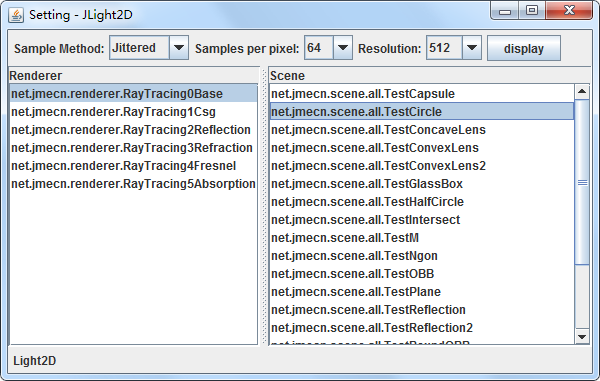

### Basic

Use Monte Carol integration and ray marching of signed distance field (SDF) to render a emissive circle.

Source code: 

* [Renderer.java](https://github.com/jmecn/JLight2d/blob/master/src/main/java/net/jmecn/Renderer.java)
* [RayTracing0Base.java](https://github.com/jmecn/JLight2d/blob/master/src/main/java/net/jmecn/renderer/RayTracing0Base.java)

Uniform sampling (64 samples per pixel):

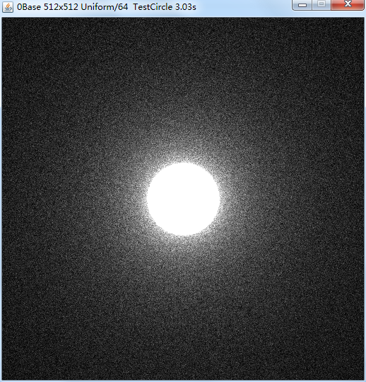

Stratified sampling (64 samples per pixel):

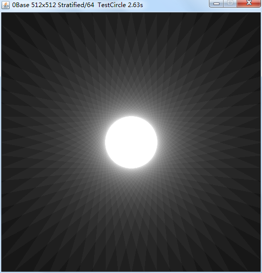

Jittered sampling (64 samples per pixel):

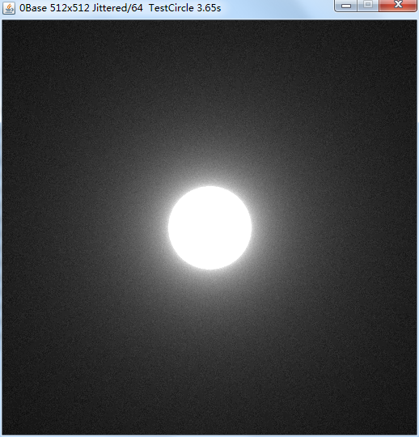

### Constructive Solid Geometry

Source code : [RayTracing1Csg.java](https://github.com/jmecn/JLight2d/blob/master/src/main/java/net/jmecn/renderer/RayTracing1Csg.java)

Use union operation for creating multiple shapes:

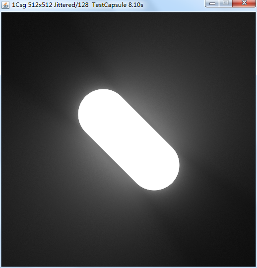

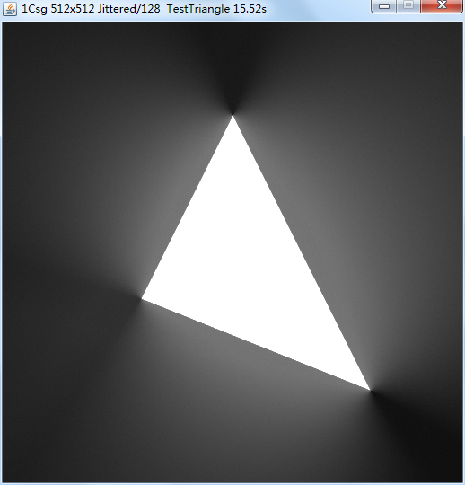

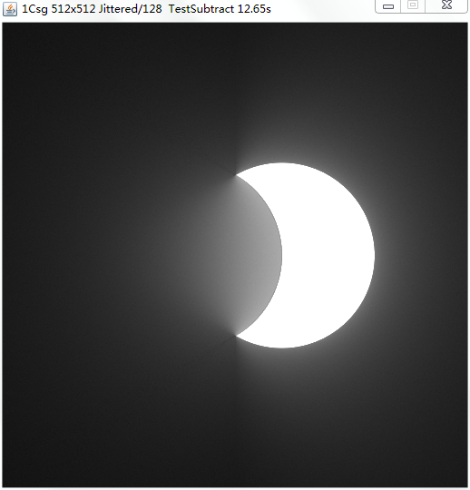

### Reflection

Source code : [RayTracing2Reflection.java](https://github.com/jmecn/JLight2d/blob/master/src/main/java/net/jmecn/renderer/RayTracing2Reflection.java)

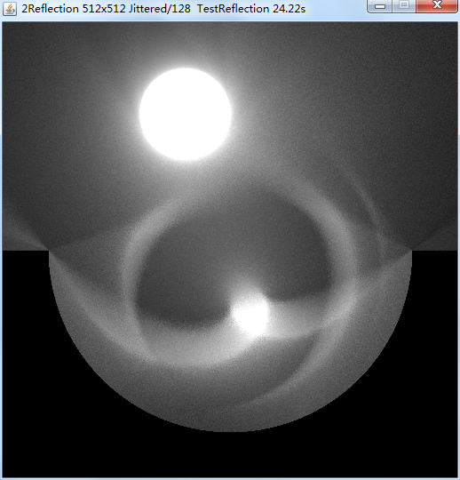

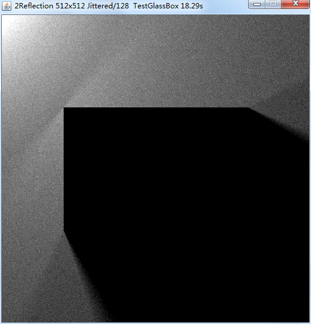

### Refraction

Source code : [RayTracing3Refraction.java](https://github.com/jmecn/JLight2d/blob/master/src/main/java/net/jmecn/renderer/RayTracing3Refraction.java)

Applying Snell's law to compute refraction direction. Total internal reflection is also handled.

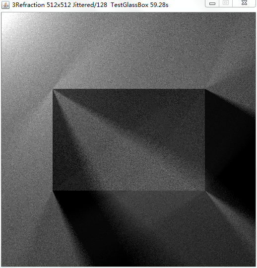

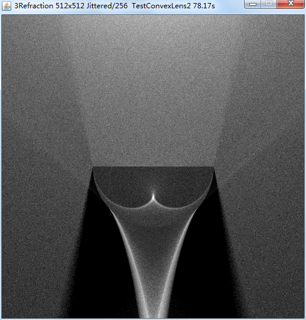

### Fresnel Reflectance

Source code : [RayTracing4Fresnel.java](https://github.com/jmecn/JLight2d/blob/master/src/main/java/net/jmecn/renderer/RayTracing4Fresnel.java)

Applying Fresnel equation to compute reflectance of dielectric medium.

without fresnel:

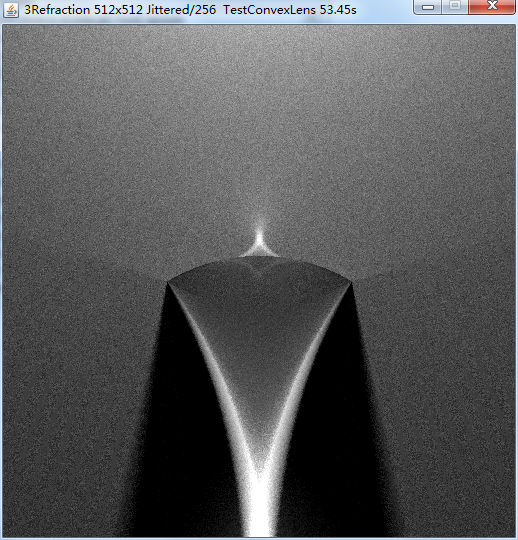

with fresnel term:

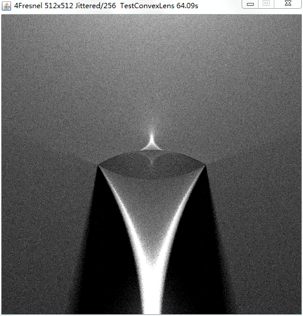

### Beer-Lambert

Source code : [RayTracing5Absorption.java](https://github.com/jmecn/JLight2d/blob/master/src/main/java/net/jmecn/renderer/RayTracing5Absorption.java)

Applying Beer-Lambert law to simulate absorption of light in medimum.

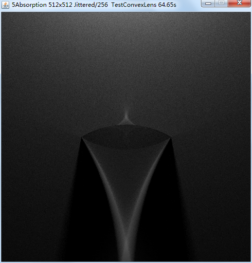

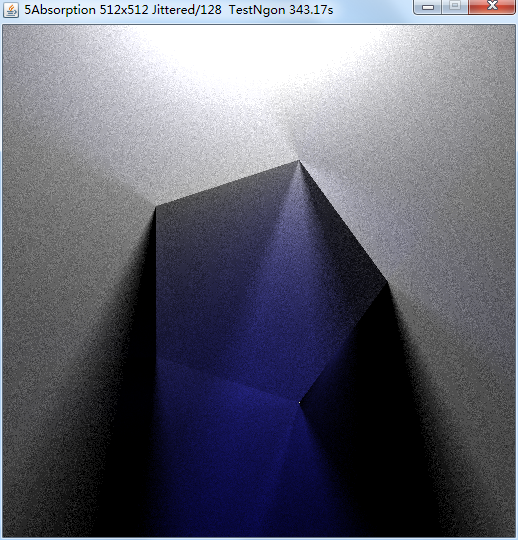